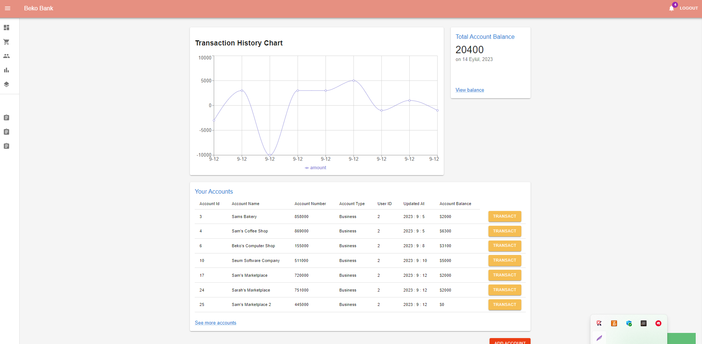
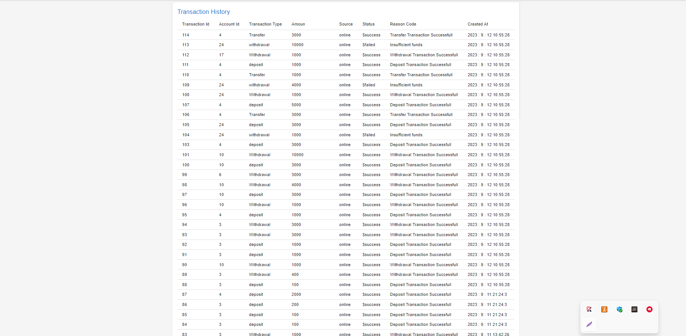

# 🏦 Online Banking System (Full-Stack)

[](https://www.oracle.com/java/)
[](https://spring.io/projects/spring-boot)
[](https://reactjs.org/)
[](https://redux.js.org/)
[](https://www.mysql.com/)
[](LICENSE)

A robust, full-stack enterprise **Online Banking Web Application** built with **Java Spring Boot**, **React with Redux**, and **MySQL**. The system enables users to manage multi-type bank accounts, execute real-time fund transfers and beneficiary payments, track financial analytics, and conduct secure transactions with JWT token-based authentication.

---

## 🌟 Key Features

- **🔐 Secure Authentication & Authorization**:
  - Stateless authentication using **JSON Web Tokens (JWT)**.
  - Salting & Password hashing via **BCrypt**.
  - Custom Spring request interceptors (`AppInterceptor`) protecting sensitive routes.
  - Auto-verification flow for seamless user onboarding.

- **💳 Account Management**:
  - Create and manage multiple bank accounts (Checking, Savings, Business).
  - Auto-generated unique bank account numbers.
  - Real-time aggregated balance computation.

- **💸 Transaction & Payment Engine**:
  - Deposits, withdrawals, and instant inter-account transfers.
  - Beneficiary payment management with unique reference tracking.
  - **ACID-compliant transactions** ensuring data safety during fund movement.

- **📊 Financial Analytics & Dashboard**:
  - Interactive charts powered by **Recharts** displaying spending trends.
  - Comprehensive history views built with optimized MySQL Views (`v_transaction_history`, `v_payments`).
  - Material-UI (MUI) sleek interface with responsive design.

---

## 🛠️ Technology Stack

| Layer | Technologies |
| :--- | :--- |
| **Frontend** | React 18, Redux Toolkit, Redux Thunk, Material-UI (MUI), Axios, React Router v6, Recharts |
| **Backend** | Java 21, Spring Boot 2.7, Spring Data JPA, Spring Security Crypto, JJWT |
| **Database** | MySQL 8.0 (Relational schema, Native SQL Queries, Foreign Keys, SQL Views) |
| **Build Tools** | Maven, npm |

---

## 📸 Application Screenshots

### 🔑 Login & Authentication


### 📊 Dashboard & Financial Analytics


### 💳 Account Details & Transfers


### 💸 Beneficiary Payments & History


---

## ⚙️ Local Setup & Running Guide

### Prerequisites
- **JDK 17 or higher** (JDK 21 recommended)
- **Node.js** (v18+) and **npm**
- **MySQL Server** (v8.0+)

---

### Step 1: Database Setup
Launch MySQL workbench or command line and execute the database schema:

```sql
CREATE DATABASE IF NOT EXISTS demo_bank_v1;
USE demo_bank_v1;

CREATE TABLE users (
    user_id     INT AUTO_INCREMENT PRIMARY KEY,
    first_name  VARCHAR(100) NOT NULL,
    last_name   VARCHAR(100) NOT NULL,
    email       VARCHAR(150) NOT NULL UNIQUE,
    password    VARCHAR(255) NOT NULL,
    token       VARCHAR(255),
    code        VARCHAR(50),
    verified    TINYINT NOT NULL DEFAULT 1,
    verified_at DATE,
    create_at   DATETIME DEFAULT CURRENT_TIMESTAMP,
    updated_at  DATETIME DEFAULT CURRENT_TIMESTAMP ON UPDATE CURRENT_TIMESTAMP
);

CREATE TABLE accounts (
    account_id     INT AUTO_INCREMENT PRIMARY KEY,
    user_id        INT NOT NULL,
    account_number VARCHAR(50) NOT NULL UNIQUE,
    account_name   VARCHAR(100) NOT NULL,
    account_type   VARCHAR(50) NOT NULL,
    balance        DECIMAL(15,2) NOT NULL DEFAULT 0.00,
    create_at      DATETIME DEFAULT CURRENT_TIMESTAMP,
    updated_at     DATETIME DEFAULT CURRENT_TIMESTAMP ON UPDATE CURRENT_TIMESTAMP,
    FOREIGN KEY (user_id) REFERENCES users(user_id)
);

CREATE TABLE transaction_history (
    transaction_id   INT AUTO_INCREMENT PRIMARY KEY,
    account_id       INT NOT NULL,
    transaction_type VARCHAR(50) NOT NULL,
    amount           DECIMAL(15,2) NOT NULL,
    source           VARCHAR(50),
    status           VARCHAR(20),
    reason_code      VARCHAR(255),
    created_at       DATETIME DEFAULT CURRENT_TIMESTAMP,
    FOREIGN KEY (account_id) REFERENCES accounts(account_id)
);

CREATE TABLE payments (
    payment_id         INT AUTO_INCREMENT PRIMARY KEY,
    account_id         INT NOT NULL,
    beneficiary        VARCHAR(150) NOT NULL,
    beneficiary_acc_no VARCHAR(50) NOT NULL,
    amount              DECIMAL(15,2) NOT NULL,
    reference_no       VARCHAR(100),
    status              VARCHAR(20),
    reason_code        VARCHAR(255),
    created_at          DATETIME DEFAULT CURRENT_TIMESTAMP,
    FOREIGN KEY (account_id) REFERENCES accounts(account_id)
);

CREATE VIEW v_transaction_history AS
SELECT
    th.transaction_id, th.account_id, a.user_id, th.transaction_type,
    th.amount, th.source, th.status, th.reason_code, th.created_at
FROM transaction_history th
JOIN accounts a ON th.account_id = a.account_id;

CREATE VIEW v_payments AS
SELECT
    p.payment_id, p.account_id, a.user_id, p.beneficiary,
    p.beneficiary_acc_no, p.amount, p.reference_no, p.status, p.reason_code, p.created_at
FROM payments p
JOIN accounts a ON p.account_id = a.account_id;
```

---

### Step 2: Configure & Start Backend (Spring Boot)
1. Navigate to `Online Banking App Spring Boot/src/main/resources/application.properties` and verify your MySQL password:
   ```properties
   spring.datasource.url=jdbc:mysql://localhost:3306/demo_bank_v1
   spring.datasource.username=root
   spring.datasource.password=YOUR_MYSQL_PASSWORD
   ```
2. Open terminal in `Online Banking App Spring Boot`:
   ```bash
   ./mvnw spring-boot:run
   ```
   *The backend will run at `http://127.0.0.1:8070`.*

---

### Step 3: Configure & Start Frontend (React Redux)
1. Open terminal in `demo-bank-redux`:
   ```bash
   npm install --legacy-peer-deps
   npm start
   ```
2. Open your web browser at `http://localhost:3000`.

---

## 👨‍💻 Developer

Developed with ❤️ by **Yuvraj Singh**
- GitHub: [@Yuvrajj13](https://github.com/Yuvrajj13)
- Project Repository: [online-banking-system](https://github.com/Yuvrajj13/online-banking-system)
